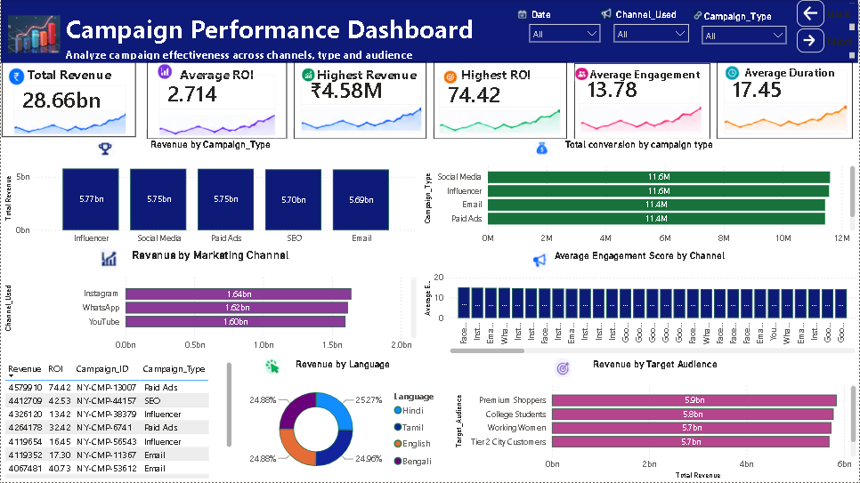
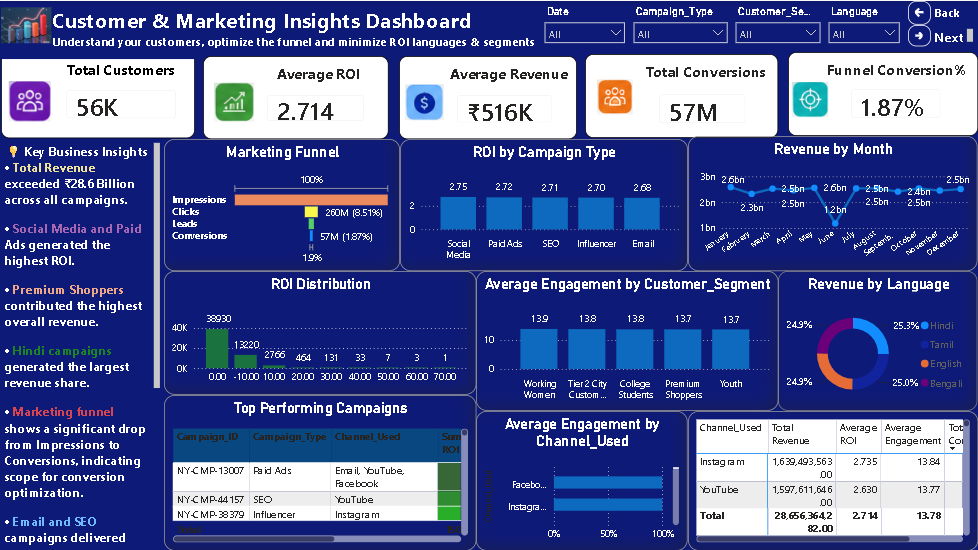

# 📊 Marketing ROI Analytics Dashboard

An end-to-end Marketing ROI Analytics project that transforms raw marketing campaign data into actionable business insights using Python, PostgreSQL, SQL, and Power BI.

This project demonstrates the complete analytics lifecycle—from data cleaning and ETL to database management, SQL analysis, KPI development, and interactive business dashboards.

---

# 🚀 Project Overview

Marketing teams often struggle to understand which campaigns generate the highest return on investment and customer engagement.

This project solves that problem by building a complete Business Intelligence solution that enables users to:

- Monitor campaign performance
- Analyze marketing ROI
- Track customer engagement
- Compare campaign effectiveness
- Identify top-performing customer segments
- Generate executive-level business insights

---

# 🛠 Tech Stack

| Category | Technologies |
|-----------|--------------|
| Programming | Python |
| Data Cleaning | Pandas, NumPy |
| Database | PostgreSQL |
| SQL | PostgreSQL SQL |
| Visualization | Power BI |
| ETL | Python |
| Version Control | Git & GitHub |
| Source Data | Excel (.xlsx) |

---

# 📂 Project Structure

```text
Marketing-ROI-Analytics
│
├── data/
│   ├── marketing_roi_raw.xlsx
│   └── marketing_campaign_cleaned.xlsx
│
├── python/
│   ├── etl.py
│   └── cleaning.py
│
├── sql/
│   ├── schema.sql
│   ├── import.sql
│   └── analysis_queries.sql
│
├── powerbi/
│   └── Marketing_ROI_Analytics.pbix
│
├── screenshots/
│   ├── executive_overview.png
│   ├── campaign_performance.png
│   └── customer_marketing_insights.png
│
├── README.md
├── requirements.txt
└── LICENSE
```

---

# 🔄 ETL Workflow

```text
Raw Excel Dataset
        │
        ▼
Python Data Cleaning
        │
        ▼
Feature Engineering
        │
        ▼
Clean Dataset
        │
        ▼
PostgreSQL Database
        │
        ▼
SQL Analysis
        │
        ▼
Power BI Dashboard
```

---

# 🗄 Database Schema

Table Name

```text
marketing_campaigns
```

Columns

- Campaign_ID
- Campaign_Type
- Target_Audience
- Duration
- Channel_Used
- Impressions
- Clicks
- Leads
- Conversions
- Revenue
- Acquisition_Cost
- ROI
- Language
- Engagement_Score
- Customer_Segment
- Date

---

# 📈 SQL Analysis

The project includes more than **35 SQL queries** covering:

- Total Revenue
- Average ROI
- Campaign Performance
- Revenue by Marketing Channel
- Revenue by Customer Segment
- Monthly Revenue
- Conversion Rate Analysis
- Window Functions
- Ranking Queries
- Subqueries
- Advanced SQL Analytics

---

# 📊 Power BI Dashboard

## 📄 Dashboard 1 — Executive Overview

Features

- KPI Cards
- Revenue Trend
- Revenue by Campaign Type
- Revenue by Marketing Channel
- Customer Segment Analysis
- Top Campaigns
- Interactive Filters

> 

---

## 📄 Dashboard 2 — Campaign Performance

Features

- Campaign Performance
- Marketing Channel Analysis
- Language Analysis
- Target Audience Performance
- ROI Comparison
- Engagement Analysis

> 

---

## 📄 Dashboard 3 — Customer & Marketing Insights

Features

- Marketing Funnel
- ROI Distribution
- Customer Segment Performance
- Revenue Trend
- Channel Performance Matrix
- Executive Business Insights

>  

---

# 📌 Key KPIs

- Total Revenue
- Average ROI
- Total Campaigns
- CTR
- Conversion Rate
- CPA
- Average Revenue
- Average Engagement
- Total Customers
- Funnel Conversion Rate

---

# 💡 Key Business Insights

- Social Media campaigns generated the highest ROI.
- Premium customer segments contributed the largest revenue.
- Marketing funnel highlights opportunities to improve conversions.
- Customer engagement positively impacts campaign performance.
- Language-specific campaigns influence revenue distribution.
- High-performing channels should receive increased marketing investment.

---

# 📈 Business Value

This dashboard helps marketing teams to:

- Improve campaign ROI
- Optimize marketing spend
- Increase customer engagement
- Monitor campaign performance
- Support data-driven business decisions

---

# ▶️ How to Run

### Clone Repository

```bash
git clone https://github.com/yourusername/Marketing-ROI-Analytics.git
```

### Install Dependencies

```bash
pip install -r requirements.txt
```

### Execute ETL

```bash
python python/etl.py
```

### Import Data into PostgreSQL

Execute

```text
schema.sql
```

and

```text
import.sql
```

### Open Dashboard

Open

```text
Marketing_ROI_Analytics.pbix
```

using Microsoft Power BI Desktop.

---

# 📷 Dashboard Preview

 
 


---

# 📜 License

This project is licensed under the MIT License.

---

# 👩‍💻 Author

**Deepa Saxena**

Data Analyst | Python | SQL | PostgreSQL | Power BI | Excel

GitHub: https://github.com/Deepa2501

LinkedIn: https://www.linkedin.com/in/deepa-saxena-694082390/